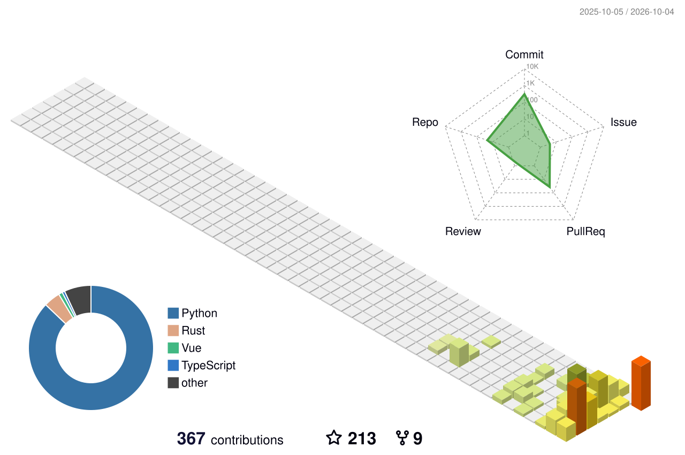

## Hi there 👋, I'm Magicapple!

## 🛠️ 我的技术栈 My Skill Set

<!-- 图标 slug 查询：https://simpleicons.org ；用法 cdn.simpleicons.org/<slug>[/颜色] -->
| AI / 工程 | 前端 | 后端 | 运维 |
|:---:|:---:|:---:|:---:|
|   |    |   |   |

## 🏂 你是第 N 个访客 You are the Nth visitor

<!-- theme 可换：asoul / gelbooru / moebooru -->

## 📊 我的数据 My Data

<picture>
  <source media="(prefers-color-scheme: dark)" srcset="https://github-readme-stats.vercel.app/api?username=magicapple123&show_icons=true&include_all_commits=true&count_private=true&theme=dark" />
  
</picture>

## 🏔️ 3D 贡献图 / 贡献城市

<!-- 风格可换：profile-green-animate / profile-season / profile-night-rainbow / profile-gitblock / profile-total -->
<picture>
  <source media="(prefers-color-scheme: dark)" srcset="./profile-3d-contrib/profile-night-rainbow.svg" />
  
</picture>

## 🥚 隐藏彩蛋（点开有惊喜）

👉 据说点开的人今年会暴富

 

你发现了这里！既然来了，顺手点个 star 再走呗 ✨

## 🐍 贡献贪吃蛇

